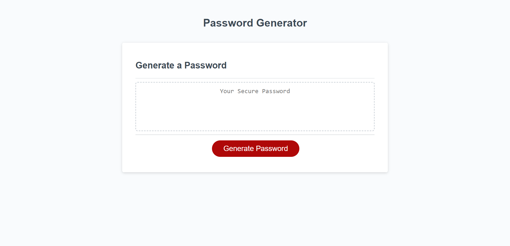
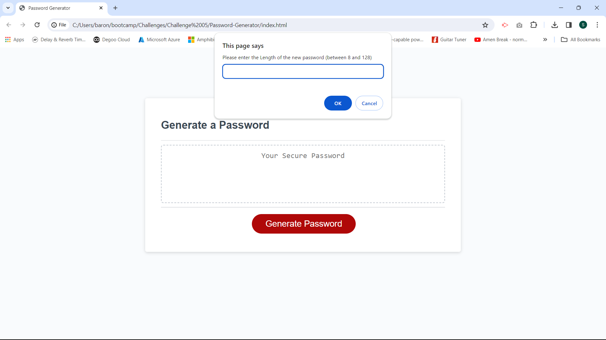
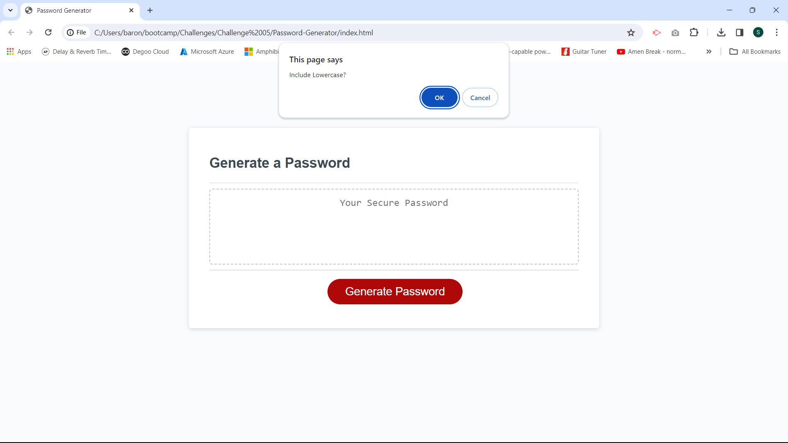
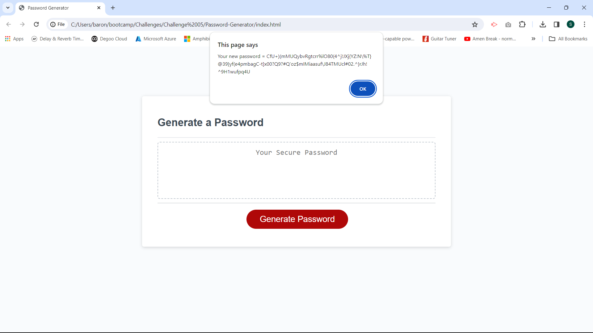
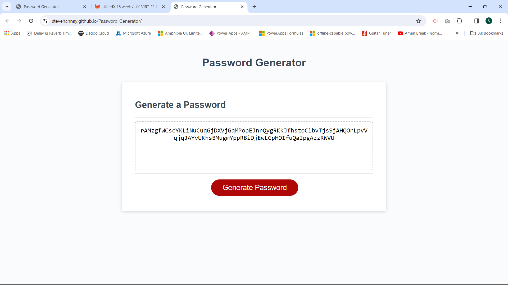

# Challenge 5 - Password-Generator

Challenge project for 05-advanced-javascript-module
 
Task - Create javascript code for a random password generator webpage

Developer - Steve Hannay
Completed - 9th Jan 2024

## Description

The aim of this project is to create a webpage which can generate a password based upon user specified criteria.

The following acceptance criteria was set for by the project :

--------------------------------------------------------------------------------------------------------------------------

    * Generate a password when the button is clicked

    * Present a series of prompts for password criteria

    * Length of password
      * At least 8 characters but no more than 128.
    
    * Character types
      * Lowercase
      * Uppercase
      * Numeric
      * Special characters ($@%&*, etc)
    
    * Code should validate for each input and at least one character type should be selected
    
    * Once prompts are answered then the password should be generated and displayed in an alert or written to the page

--------------------------------------------------------------------------------------------------------------------------

During the process of working on this project I have learned more about the fundamentals of javascript coding, including the use of arrays, loops, conditional statements, random numbers and event handling. 

Furthermore, I have become a little more familiar with working with GitHub and ReadMe files.

## Installation

Open the following webpage from any internet browser.

[Challenge 5 - link to Password Generator deployed webpage](https://stevehannay.github.io/Password-Generator)

No installation is necessary. 

## Usage

This is a very simple webpage to use.

- Click on the "Generate Passord" button.

- Click through the various prompts that will appear on screen. Prompts will appear to enter the following :

    - Length of Password (between 8 and 128 chracters)

    - Include Lower Case (Ok/Cancel)
    - Include Upper Case (Ok/Cancel)
    - Include Numberic (Ok/Cancel)
    - Include Special Chatracters (Ok/Cancel)

    (at least one type of character type must be selected)

- A new password will be generated and displayed on screen.

Here are screenshots of the Generate Password the webpage created for the project.

- This is the webpage with the "Generate Password" coloured in red.

- This is the "Enter Length" message, prompting the user to enter a value.

- This is the "Include Lower Case?" message, prompting the user to choose whether to include Lower Case characters.
- note : Similar messages then appear for "Include Upper Case?", "Include Numeric?" and "Include Special Characters?". 

- The new password is generated and displayed to the user in a message.

- The new password is also displayed on the webpage itself.

## Credits

This is a single developer project, based upon what I have been taught by the Bootcamp team.

During the project I studied and used extracts of various code supplied by the Bootcamp when teaching the previous modules and I referenced various online resources including those listed below.

The following information was referenced while coding the project.

[w3 school - Javascript concatonating arrays](https://www.w3schools.com/jsref/jsref_concat_array.asp)

[w3 resource - Javascript get random element from arrays](https://www.w3resource.com/javascript-exercises/javascript-array-exercise-35.php)

[w3 school - Javascript event listeners](https://www.w3schools.com/js/js_htmldom_eventlistener.asp)

## License

No licence is currently associated with this project.
